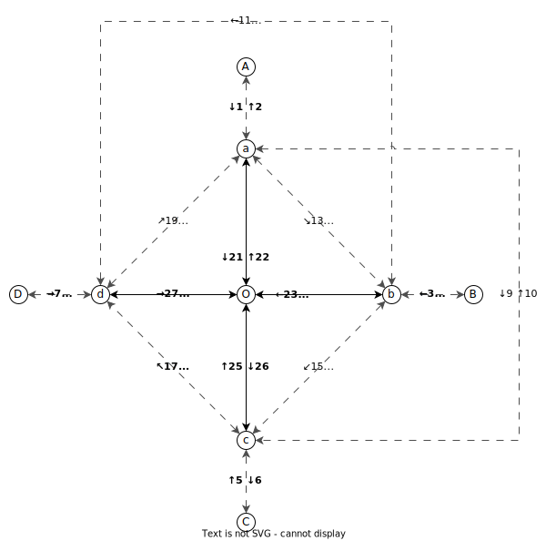

# 十亿伏特 GigaVoltage
## 简介 Introduction
这是一个为生存战争游戏带来十亿伏特电力系统的mod，将原版的16个电压级别（0\~1.5V）扩展到2^32个（0\~2^32-1V）  
This is a mod for Survivalcraft that take a new Electric system with Gigavolt to the game. The original Electric system has 16 voltage level(0\~1.5V), then Gigavolt expands it to 2^32 voltage level(0\~2^32-1V).
## 看板娘 Yuru-chara

## 区别 Differences
|方块| 原版                           | 十亿伏特版                                                                                          |
|--|------------------------------|------------------------------------------------------------------------------------------------|
|SR锁存器| S端高压才储存                      | S端非0即储存                                                                                        |
|开关、按钮、电池| 默认输出1.5V                     | 默认输出0xFFFFFFFF V，其他原本默认输出1.5V的也改为默认输出此电压，不提供经典版                                                |
|计数器| 默认溢出电压为0x10V，上限为0xF V        | 默认溢出电压为0V，上限0xFFFFFFFF V，可设置溢出电压                                                               |
|真值表| 略                            | 详见[详细-真值表](#真值表-truth-table)                                                                   |
|存储器| 略                            | 详见[详细-存储器](#存储器-memory-band)                                                                   |
|数模转换器| 略                            | 变更为4个合并器，分别是4个1位合并成4位、4个2位合并成8位、4个4位合并成16位，4个8位合并成32位，对于要被合并的输入，会在合并前分别取它们最低的1、2、4、8位后，按顺序进行合并 |
|模数转换器| 略                            | 和数模转换器类似，被变更为4个拆分器，同理，输入在拆分前会被分别取最低的4、8、16、32位，再按顺序输出拆分结果                                      |
|声音发生器| 略                            | 详见[详细-声音发生器](#声音发生器-sound-generator)                                                           |
|压力板| 有压力时输出0.8\~1.5V，随意设置的压力与电压关系 | 输出准确的压力值，参考16进制结果：男性玩家0x46V，虎鲸0x5DC V                                                          |
|活塞| 0.8V开始伸长                     | 1V开始伸长，提高了伸长、黏住、速度上限（黏住过多时卡住是游戏其他子系统问题），不提供经典版                                                 |
|彩色LED、1面LED| 0.8\~1.5V对应不同颜色。输入0V时显示。     | 所有电压对应不同颜色（ABGR格式）。1面LED使用独立的新发光子系统，支持半透明，可无缝拼接。输入0时不显示。                                       |
|靶子| 输出0.8\~1.5V                  | 输出0\~0xFFFFFF00 V，因游戏坐标精度问题，最低8位为0                                                             |
|电子雷管| 输入0.8v及以上电压产生威力为10的爆炸        | 输入0v以上电压产生威力等于电压的爆炸                                                                            |
## 新增 New
|名称|特性|
|--|--|
|调试石碑|提供电路运行速率调整、单步运行功能的石碑。|
|8x4面LED灯|和原版4面LED灯类似，但它有4x2、4x4、8x4三种布局，只提供白光。|
## 详细 Details
### 存储器 Memory Band
为存储远超原版的数据量，该Mod将数据无损保存为了[PNG](https://www.w3.org/TR/png/)图片格式，因此需要先手动设置长宽，而且之后不可在编辑界面修改，长宽上限均为2^31-1，但为了避免不可预知的错误，请不要设置如此巨大的矩阵  
编辑界面用文字编辑时，每个数据用英文逗号`,`分开，每行数据用英文分号`;`分开  
当数据量较大时，不建议继续文本编辑，而建议使用图片编辑工具手动编辑导出的png文件后重新导入  
> 附失败的在线编辑器[https://xiaofengdizhu.github.io/GVMBEditor](https://xiaofengdizhu.github.io/GVMBEditor)

png要求颜色模式为24位带透明通道的RGB模式，因为游戏引擎的缘故，像素颜色会按照透明通道、蓝色、绿色、红色的顺序（即ABGR）保存进电压数据中，例如ARGB顺序的AABBCCDD像素，会被转换成AADDCCBB V的电压数据  
你不仅能够导入png文件，还能导入WAV格式的音频文件，要求为双声道，采样率8000~48000Hz之间，采样位数16位，PCM编码，检测完毕后将自动导入该文件的`data chunk`部分，例如`data chunk`开头的6个16位数据为0x0001、0x0002、0x3333、0x4567、0xBA98、0xCDEF，写入存储器的数据将是：0x00010002、0x33334567、0xBA98CDEF；当导入非png和wav的普通文件时，将从开头直接32位32位地读取并写入存储器中
### 真值表 Truth Table
表征逻辑事件输入和输出之间全部可能状态的表格
#### 例子 Examples
此套规则的计算表达式基于[NCalc2](https://github.com/sklose/NCalc2)，写法类似于Excel公式，请先看具体例子：  
* `1;2;3;4:5`输入1\~4分别为1、2、3、4V时，输出5V  
* `>0x1;<=0xA;i3>1&&i3<99:0xABC`输入1大于1V，输入2小于等于十六进制A V，输入3同时满足大于1V和小于99V，输出4为任意值时，输出十六进制ABC V  
* `0;0;0;0;;i2;true;>i1:10`输入变化前输入1~4均为0V；变化后输入1等于输入2，输入2为任意值（也可以写i1，但没必要，不过因为还要设定输入3的规则，所以此处需填true），输入3大于输入1，输入4为任意值，输出10V（使用两个英文引号`;;`分开输入变化前的规则和变化后的规则，最多可以获取15次输入变化前的规则）  
* `0;;1;;2;;3:4::5:6::7:8`现在输入1为3V，输入变化前输入1为2V，再上一次输入变化前输入1为1V，再上一次输入变化前输入为0V，则现在输出4V；如果前一组规则未满足，则继续计算下一组规则`5:6` ，未满足则再计算下一组规则`7:8`（使用两个英文冒号`::`分开多套输入输出规则）  
* `true;true;Min(i1,i2),Max(i1,i2):i1+i2`输入1、2为任意值，输入3是输入1、输入2中的较小值，输入4是输入1、输入2中的较大值，则输出输入1+输入2  
#### 规则 Rules
* 4个输入规则之间用英文分号`;`分隔，如果只给输入1、2设定规则，输入3、4的规则可以不写，但也请不要加上多余的`;`；不能只给输入1、3设定规则，至少要给第2输入设定规则`true`  
* 如果输入规则的开头是`=`、`!=`、`>`、`<`，此Mod会根据是第几个输入，自动在开头加上`i1`、`i2`……  
* 如果输入规则不是`true`，且不包含`=`、`!`、`not`、`>`、`<`、`and`、`&&`、`||`、`or`中的任意一个操作符，此Mod会自动在开头加上`i1=`、`i2=`……  
* 使用两个英文引号`;;`来分隔时序，越左边时序越早，最右边的时序是现在的输入，最多取得15次变化前的输入  
* 只有输入规则的计算结果是`true`时，才会计算下一个输入规则，然后计算下一组时序，直到所有规则计算结果均为`true`，才会计算此组规则设定的输出  
* 使用英文冒号`:`来分隔所有输入规则和输出规则，输出规则的计算结果必须为自然数（>=0的整数）  
* 使用两个英文冒号`::`来分隔多套输入输出规则，当第一套规则不输出时，则计算下一套规则，直到有输出为止，最多2^32-1套  
* 过程中出现任何错误均会直接停止计算并输出0，错误详见游戏日志
> **注意**：规则对大小写敏感！

如果想了解更多，请参见以下链接：
* [操作符](https://github.com/ncalc/ncalc/wiki/Operators)
* [函数](https://github.com/ncalc/ncalc/wiki/Functions)
* [值](https://github.com/ncalc/ncalc/wiki/Values)
### 声音发生器 Sound Generator
可以从存储器加载WAV格式音频数据并播放的声音发生器  
#### 端口定义 Input Definition
|端口|作用|说明|
|--|--|--|
|后端|存储器ID|下端为0V，此端电压发生变化时，从指定ID的存储器读取音频数据|
|左端|采样率|范围限制：8000\~48000，对应十六进制：1F40\~BB80|
|上端|播放开始位置|设置从第n个16位数据开始播放，仅在读取音频数据时发生作用；例如左端设为44100V，此端设为88200V，那么将从88200V/2/44100=1秒处开始播放|
|右端|播放数量|设置播放n个16位数据，仅在读取音频数据时发生作用|
|下端|响度|电压从0V上升后立即开始播放，设为0V停止，再上升后从头播放，电压越高响度越大|
#### 音频转换 Sound Conversion
要使用声音发生器，首先需要使用[ffmpeg](https://ffmpeg.org/)或[格式工厂](http://www.pcgeshi.com/index.html)等软件将音频转换为双声道，采样率8000~48000Hz之间，采样位数16位，PCM编码的WAV格式音频，再使用存储器的导入功能导入该文件
# GigaVoltage.Expand 十亿伏特·扩展
## 简介 Introduction
这是一个为生存战争游戏十亿伏特mod带来更多电路板和功能的mod  
This is a mod for Survivalcraft Gigavolt mod that take more circuit components and functions to the mod.
## 看板娘 Yuru-chara

## 简单方块 Simple Blocks
| 名称    | 特性                                                                                                                                                                                                                                              |
|-------|-------------------------------------------------------------------------------------------------------------------------------------------------------------------------------------------------------------------------------------------------|
| 铜锤    | 将一格范围内已摆放好的导线转换为穿线块，已摆放导线的面将互相连通，未摆放导线的面不互通；多次对生成的穿线块使用将改变其外观，第5次恢复为普通导线；可染色，仅影响外观，不影响接线                                                                                                                                                        |
| 六面跨线块 | 相对的两面互相导通；可染色，仅影响外观，不影响接线                                                                                                                                                                                                                       |
| 跳线    | 背端-标签，下端-输入，上端-输出，左端-是否从下端输入，右端-是否从其他跳线输入，具体：背端输入大于0V的电压时，将与其他背面输入一样电压（即标签相同）的跳线相连接；当左端输入电压大于7V时，会将下端输入的电压输出到标签相同的其他跳线；当右端输入电压大于7V时，将会从标签相同的其他跳线获取其下端输入的电压，如果其他跳线的左端输入小于7V，则获取不到这个跳线的下端电压；最后，从下端和标签相同的其他跳线获取的电压在进行或运算后从上端输出。标签相同的跳线间将形成一条绿色的指示线 |
|8数字LED灯| 和7段显示器类似，但它一次显示8位16进制数，只提供白光                                                                                                                                                                                                                    |
|方块值板| 其上有方块时，会输出等于最后一块放上的方块值的电信号，一旦所有方块离开，输出立即变为0V                                                                                                                                                                                                    |
|简单方块展示板| 输入等于存储了方块数据的存储板ID的电压，就会在其面前显示方块                                                                                                                                                                                                                 |
|简单图片显示器| 输入等于存储了图形数据的存储板ID的电压，就会在其面前显示图片                                                                                                                                                                                                                 |
|地层显示器| 输入等于存储了地层数据的存储板ID的电压，就会在其面前显示地层（CPU占用高，请勿显示过大的地层）                                                                                                                                                                                               |
## 复杂方块 Complex Blocks
### 更多两入两出电路板 More Two In Two Out Electrics
左和右是输入端，上和后是本位输出端，下是溢出/借位等输出端  
提供以下电路板：

|电路板名称|本位输出说明|溢出/借位输出端说明|
|--|--|--|
|加法器|左+右，结果超过2^32时输出后32位|溢出时输出1V|
|减法器|左-右，结果小于0时加上2^32|需要借位时输出1V|
|乘法器|左*右，结果超过2^32时输出后32位|溢出时输出结果倒数第二后的32位|
|除法器|左/右，整数计算只保留整数部分|0V|
|取余器|左%右，整数计算|0V|
|等于门|左\=\=右时输出0xFFFFFFFF V，否则0V|0V|
|大于门|略|0V|
|大于等于门|略|0V|
|小于门|略|0V|
|小于等于门|略|0V|
|取大器|取两边较大的输入作为输出|0V|
|取小器|取两边较小的输入作为输出|0V|
|左移器|左<<右，结果超过2^32时输出后32位|溢出时输出结果倒数第二后的32位|
|右移器|左>>右|左<<32>>右的后32位|
|乘方器|左\^右，结果超过2\^32时输出后32位|溢出时输出结果倒数第二后的32位|
|对数器|$log_{右}左$ ，整数计算只保留整数部分|0V|
### 路选器 Multiplexer
可以通过背面控制正面四个端点的导通和断开，内部设计如下图  
  
* 圆圈代表电压节点，ABCD四个节点能从正面1234四个端点输入和输出电压，abcdO是辅助节点
* 虚线代表常断的电压通路，共10条；实线代表常通的电压通路，共8条
* 每条通路由两根单向导线组成，每根导线上都有一个开关，共28个开关
* 可以通过背面电压控制这28个开关：
  * 对于常断通路，例如最低1位为1时，图中1号开关闭合，导线导通，电压能从A传导到a；第2低的位为1时，图中2号开关闭合，导线导通，电压能从a传导到A，以此类推
  * 对于常通通路，例如第26位为1时，电压将不能直接从O传导到c
* 节点接收到新的电压时，会与此电压进行或运算，得到新的电压，例如节点c原本的电压是5V，从节点O收到3V，节点c的电压将会变成5|3=7V
* 节点电压发生变化后，将向能传导到的其他节点传导新的电压，直到所有节点电压稳定，最后从ABCD节点向正面1234端点输出结果
* 每次背面和正面输入的电压发生变化时，内部节点都将复位归0，重新计算输出结果
> 例子：背面输入16进制的21V（二进制100001），开关1、6将闭合，此时在正面1端点输入5V，该电压将从A节点流入，延导线1传导到a，延21传导到O，延26传导到c，延6传导到C，最终从正面3号端点输出5V
### 增强实时钟
与实时钟类型，但输出的是现实世界的时间（从运行设备获取），而且背端是输入，背端不同输入，正面四个端口将有不同的输出

|背端输入|端口1|端口2|端口3|端口4|
|--|--|--|--|--|
|0V或其他|毫秒|秒|分|时|
|1V|星期|日|月|年|
|2V|计时周期的低32位|计时周期的高32位|0V|0V|
|3V|距离开始降水的时间，或已经降水的时间|降水时输出FFFFFFFF V，否则0V|距离结束降水的时间|0V|
> 计时周期：公历中自公历0001年1月1日午夜00:00:00.000以来经过的以100纳秒为间隔的数目，不包括归因于闰秒的嘀嗒数
### 复杂方块展示板
和简单方块展示板类似，但它可以控制绘制的方块的大小、位置、旋转、亮度、颜色，具体端口定义如下（从左到右为高位到低位）
<table>
    <thead align="center">
        <tr>
            <th>端口</th>
            <th colspan="4">作用</th>
        </tr>
    </thead>
    <tbody align="center">
        <tr>
            <td rowspan=2>后端</td>
            <td colspan="4">32位 要显示的方块值</td>
        </tr>
        <tr>
            <td colspan="4">最低10位为方块ID，14位以上为方块数据</td>
        </tr>
        <tr>
            <td rowspan="2">上端</td>
            <td colspan="2">16位 Y轴位置偏移</td>
            <td colspan="2">16位 缩放大小</td>
        </tr>
        <tr>
            <td colspan="2">每加1向上移动1/8格，最高位为1时取负，即移动范围为±4096格</td>
            <td colspan="2">每加1缩放增加1/8格大小，最大8192倍</td>
        </tr>
        <tr>
            <td rowspan="2">右端</td>
            <td colspan="2">16位 Z轴位置偏移</td>
            <td colspan="2">16位 X轴位置偏移</td>
        </tr>
        <tr>
            <td colspan="2">每加1向西移动1/8格</td>
            <td colspan="2">每加1向北移动1/8格</td>
        </tr>
        <tr>
            <td rowspan="2">下端</td>
            <td>4位 亮度</td>
            <td>1位 空</td>
            <td>3位 旋转的符号</td>
            <td>24位 旋转</td>
        </tr>
        <tr>
            <td>越大越亮</td>
            <td>无作用</td>
            <td>从高到低的3位分别控制偏航角、俯仰角、翻滚角的正负，为1时取负</td>
            <td>从高到低，每8位分别控制方块的偏航角（Yaw）、俯仰角（Pitch）、翻滚角（Roll），单位为角度</td>
        </tr>
        <tr>
            <td rowspan=2>左端</td>
            <td colspan="4">32位 颜色</td>
        </tr>
        <tr>
            <td colspan="4">控制方块的颜色，ABGR格式</td>
        </tr>
    </tbody>
</table>

### 复杂图片和地层显示器 Complex Image and Stratum Display
和复杂方块展示板类似，但背端需要输入存储板的ID，之后它就会以指定的方式显示图片或地层（地层也是以图片的形式显示）。  
另外，对于复杂方块展示板来说下端无作用的一位（从低到高第28位），可用于指定图片的缩放方式，为0时将以各向异性过滤方式缩放，为1时将以保留硬边缘方式缩放。
### 地形射线探测器 Terrain Raycast Detector
向探测器面对的方向逐格探测是否存在非空气方块，并返回方块值、距离、连续多少个相同方块，需要先设置探测距离；还具有探测指定方块等功能，详见下表
<table>
    <thead align="center">
        <tr>
            <th colspan="2">端口</th>
            <th colspan="4">作用</th>
        </tr>
    </thead>
    <tbody align="center">
        <tr>
            <td rowspan="4">输入</td>
            <td rowspan=2>左端</td>
            <td>18位 检测指定方块数据</td>
            <td>4位 空</td>
            <td>10位 检测指定方块ID</td>
        </tr>
        <tr>
            <td>如果该部分大于0，且“是否同时检测方块数据”位为1，且“检测指定方块ID”部分大于0，则探测方块时同时检测方块数据是否与该部分相等</td>
            <td>无作用</td>
            <td>如果该部分大于0，将只探测方块ID与该部分相等的方块</td>
        </tr>
        <tr>
            <td rowspan="2">右端</td>
            <td>12位 探测距离</td>
            <td>1位 是否同时检测方块数据</td>
            <td>1位 是否跳过液体</td>
        </tr>
        <tr>
            <td>最多探测多少格</td>
            <td>详见“检测指定方块数据”的说明</td>
            <td>如果为1，探测时将跳过水和岩浆方块，该设置优先级高于检测指定方块ID</td>
        </tr>
        <tr>
            <td rowspan="6">输出</td>
            <td rowspan="2">上端</td>
            <td colspan="3">32位 方块值</td>
        </tr>
        <tr>
            <td colspan="3">探测到最近的符合条件的方块的值（最低10位为方块ID，14位以上为方块数据）</td>
        </tr>
        <tr>
            <td rowspan="2">下端</td>
            <td  colspan="3">32位 距离</td>
        </tr>
        <tr>
            <td  colspan="3">探测到最近的符合条件的方块的距离，单位格</td>
        </tr>
        <tr>
            <td rowspan=2>后端</td>
            <td colspan="3">32位 连续方块数量</td>
        </tr>
        <tr>
            <td colspan="3">探测到符合条件的方块后，输出当前方向连续出现了多少个该方块</td>
        </tr>
    </tbody>
</table>

### 红白机模拟器 Nes Emulator
可以模拟红白机的模拟器，使用的库是[XamariNES](https://github.com/enusbaum/XamariNES)，纯软件模拟（CPU运算），不支持声音输出，仅支持CNROM、MMC1、NROM、UxROM四种ROM格式的游戏，可能能够支持的游戏有超级玛丽、双截龙、恶魔城、冒险岛、勇者斗恶龙、合金装备、魂斗罗  
整个游戏同时仅运行一个模拟器实例，多个红白机模拟器方块显示的内容是一样的，输入的手柄操作会按或计算后传输给模拟器，因此可以同屏异地联机  
游戏运行时会自动加载XamariNES内置测试ROM，如果要载入其他ROM，请编辑该方块，输入ROM的路径，或存储器的ID，点击确定，会立即从指定路径、内存板读取ROM，输入`nestest`则载入XamariNES内置测试ROM
方块的各面输入会按或计算后执行，电压各位从低到高作用如下：

|位|作用|说明|
|--|--|--|
|1|电源|0为关闭，1为开启|
|2|重置|0为不重置，1为执行重置；如一直为1，会不停重置|
|3\~4|旋转|0为正位，1为顺时针旋转90度，2、3同理|
|5\~8|空|无作用|
|9\~16|手柄1|从高位到低位分别对应：→←↓↑StartSelectBA|
|17\~24|手柄2|尚未支持|
|25\~31|缩放|0、1为1个方块大，2为2个方块大，最大128方块大|
|32|空|无作用|